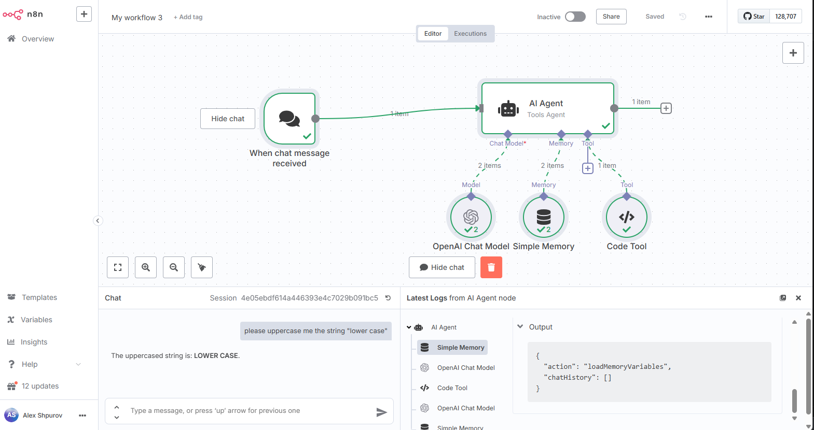

# n8n Basic Agent (Hello OpenAI Agent)

A minimal chat-first n8n agent that:
- Starts from an n8n Chat Trigger
- Uses an OpenAI Chat Model (default `gpt-4o-mini`)
- Runs as a LangChain Agent with a simple Code Tool (uppercases text)
- Keeps short-term context using a Buffer Window memory



## Prerequisites
- Docker and Docker Compose
- An OpenAI API key (to configure an OpenAI credential in n8n)

## Quickstart
1) Start the local stack from this folder:
```bash
docker compose up -d
# n8n UI: http://localhost:5678
```

2) In n8n, add an OpenAI credential:
- Settings → Credentials → New → OpenAI API
- Paste your API key and save

3) Import the workflow into n8n:
- Workflows → Import from File → select `workflow.hello-openai-agent.json`
- Open the `OpenAI Chat Model` node and select your OpenAI credential
- Activate the workflow

4) Chat with the agent:
- Open the workflow and click the Chat panel (speech bubble icon)
- Send a message like: “uppercase hello world”
- The agent should call the Code Tool and reply with `HELLO WORLD`

## How it works
- `When chat message received` (Chat Trigger): receives user messages from the n8n chat panel
- `AI Agent`: LangChain Agent orchestrating the model, memory, and tools
- `OpenAI Chat Model`: LLM used by the agent (default: `gpt-4o-mini`)
- `Simple Memory`: Buffer window memory to preserve short-term context
- `Code Tool`: a simple tool the agent can call to uppercase text

## Configuration
- Model: set in the `OpenAI Chat Model` node
- Tools: the `Code Tool` can be extended or replaced with your own logic
- Memory: `Simple Memory` keeps a small conversational window; adjust as needed

## Troubleshooting
- If the Chat panel does not appear, ensure the Chat Trigger node is present and the workflow is saved/active
- If messages fail, confirm the `OpenAI Chat Model` node has a valid credential selected
- Check container logs: `docker compose logs -f n8n`

## Notes
- This template uses n8n credentials for OpenAI (not environment-variable substitution in a raw HTTP node)
- The provided `docker-compose.yaml` brings up n8n and Postgres with persistence for local development
